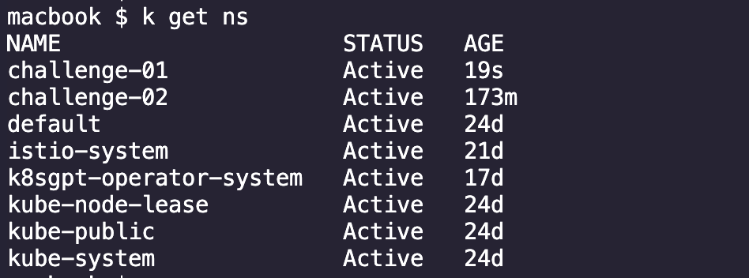
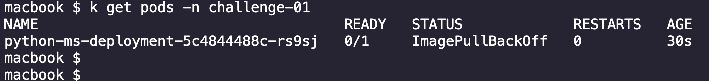
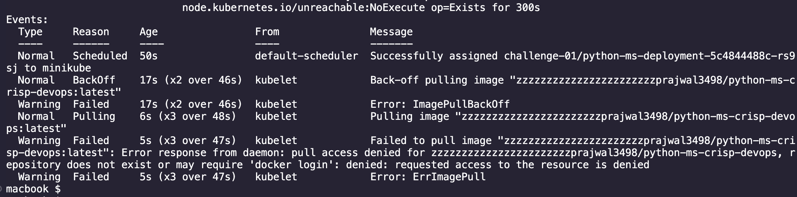
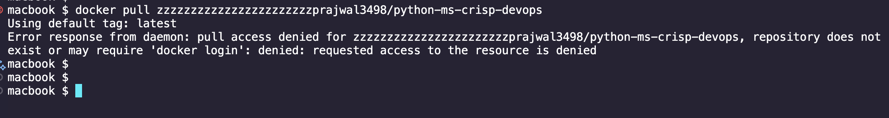

# Solutions 

Error : "ImagePullBackOff" due to incorrect image name

# Troubleshooting Steps

```bash
alias k=kubectl
```

Step 1: Check the namespace where the pod is running
```bash
k get ns
```


Step 2: Check the pod status. We see that the pod is in "ImagePullBackOff" state
```bash
k get pods -n challenge-01
```


Step 3: Check the pod events using the describe command
```bash
k describe pod <POD_NAME> -n challenge-01
```


Step 4: Try to pull the image manually
```bash
docker pull zzzzzzzzzzzzzzzzzzzzzzzprajwal3498/python-ms-crisp-devops
```


We see that the image is not available or the image name is incorrect.


## Solution

Edit the deployment and correct the image name. Apply the changes.

```bash
k apply -f . 
```