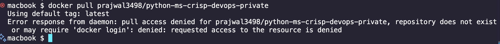

# Solutions 

Error : "ImagePullBackOff" due to private registry

# Troubleshooting Steps

```bash
alias k=kubectl
```

Step 1: Check the namespace where the pod is running
```bash
k get ns
```


Step 2: Check the pod status. We see that the pod is in "ImagePullBackOff" state
```bash
k get pods -n challenge-02
```


Step 3: Check the pod events using the describe command
```bash
k describe pod python-ms-deployment-7599f96dff-xfw62 -n challenge-02
```


Step 4: Try to pull the image manually
```bash
docker pull prajwal3498/python-ms-crisp-devops-private
```


We see that the image is not available or the image is in a private registry (may require docker login).

Step 5: Check the secret used for the private registry
```bash
k get secrets -n challenge-02
```


Looks like the secret is not created. We need to create a secret for the private registry and attach it to the deployment.


## Solution

Step 1: Create a secret for the private registry
```bash
kubectl create secret docker-registry regcred --docker-server=https://index.docker.io/v1/ --docker-username=<USERNAME> --docker-password=<Personal_Access_Token> --dry-run=client -o yaml >> ns_deploy_svc.yml
```

Step 2: Attach the secret to the deployment
Same process for deployment as mentioned for pods in this document (https://kubernetes.io/docs/tasks/configure-pod-container/pull-image-private-registry/#create-a-pod-that-uses-your-secret)

Step 3: Apply the changes
```bash
k apply -f ns_deploy_svc.yml
```

Step 4: Check the pod status
```bash
k get pods -n challenge-02
```