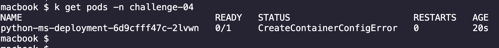

# Solutions 

Error : "CreateContainerConfigError" due to incorrect secrets details

# Troubleshooting Steps

```bash
alias k=kubectl
```

Step 1: Check the namespace where the pod is running
```bash
k get ns
```


Step 2: Check the pod status. We see that the pod is in "CreateContainerConfigErro" state
```bash
k get pods -n challenge-04
```


Step 3: Check the pod events using the describe command
```bash
k describe pod <POD_NAME> -n challenge-04
```


Step 4: Check the configmap details
```bash
k get cm -n challenge-04
```


Step 5: Check the configmap used in the deployment
```bash
k describe deployment <DEPLOYMENT_NAME> -n challenge-04
```


We see that the configmap details are incorrect. We need to correct the configmap details.

## Solution

We can edit the configmap and apply the changes.

```bash
k apply -f . 
```